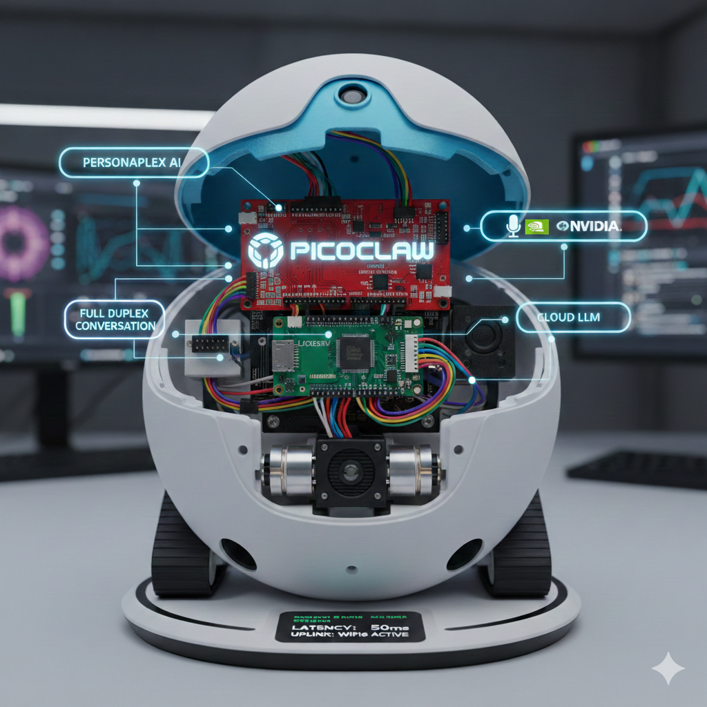

# PicoClaw-Ebo




PicoClaw-Ebo combines the PicoClaw autonomous agent with an Enabot Ebo Air 2 chassis and a LicheeRV Nano (SG2002). The platform is designed around a hybrid model: low-latency local perception/control plus cloud reasoning.

## Quick Summary

- Local intelligence: SG2002 NPU for real-time YOLO inference and safety-critical perception.
- Cloud intelligence: LLMs for semantic reasoning, identity verification, and conversation.
- Lightweight core: PicoClaw in Go with low memory footprint.
- Control bridge: Python BLE emulation layer to command the Ebo motors.
- Media/control split: WebRTC for low-latency media, TCP/WebSocket for control and state.

## Build

Prerequisites:
- Go toolchain available in `PATH` (`go version`)
- GNU Make

Common commands:

```bash
make deps
make build
```

Cross-platform binaries:

```bash
make build-all
```

Build outputs:
- Host build: `build/picoclaw-<os>-<arch>`
- Multi-target build artifacts: `build/picoclaw-linux-amd64`, `build/picoclaw-linux-arm64`, `build/picoclaw-linux-loong64`, `build/picoclaw-linux-riscv64`, `build/picoclaw-darwin-arm64`, `build/picoclaw-windows-amd64.exe`

Build note:
- `go generate` prepares embedded workspace assets for onboarding.
- The generate rule excludes heavy local emulation artifacts (`workspace/emulation/buildroot`, `workspace/emulation/riscv64`) to keep build time and binary size under control.

## Documentation Map

- `README.md` (this file): project entry point and build commands.
- `docs/picoclaw_ebo_architecture.md`: architecture decisions, technical constraints, interfaces.
- `docs/picoclaw_ebo_development_simulation.md`: simulation/development strategy and workflows.
- `QUICKSTART_SIMULATION.md`: validated operational runbook with concrete commands and results.
