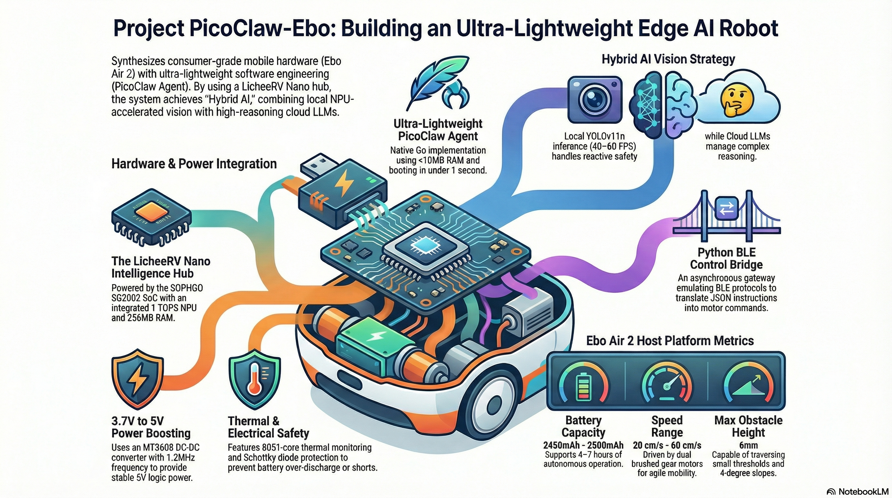

# PicoClaw-Ebo Architecture Approach

This document captures the architecture direction for Project PicoClaw-Ebo: a hybrid AI stack that combines low-latency, on-device perception with cloud-based reasoning. The approach prioritizes safety, responsiveness, and reliability inside a thermally constrained mobile chassis.

## Goals

- Deliver real-time perception and navigation locally, independent of network latency.
- Provide rich cognitive interaction via cloud LLMs without blocking the control loop.
- Preserve battery safety and thermal margins inside a compact enclosure.
- Maintain a minimal software footprint with fast boot and low RAM usage.

## System Overview

PicoClaw-Ebo integrates a LicheeRV Nano (SOPHGO SG2002 SoC) inside an Enabot Ebo Air 2 chassis. The SG2002 NPU provides local vision inference while cloud LLMs supply semantic reasoning and dialogue. A Python BLE gateway emulates the Ebo protocol for motor control. Audio and video are delivered over WebRTC.

## Architecture Layers

1. Edge perception
   - SG2002 NPU executes YOLO models for person and object detection.
   - Local perception remains active even during cloud outages.

2. Control bridge
   - Python gateway translates high-level commands to BLE GATT writes.
   - Safety commands are prioritized to reduce response latency.

3. Cognitive layer
   - PicoClaw (Go) orchestrates tasks and calls cloud LLMs.
   - Remote reasoning augments local perception without blocking it.

4. Media and telemetry
   - WebRTC handles low-latency audio and video streams.
   - TCP channels handle state updates and control reliability.

## Key Hardware Constraints

Chassis baseline (Enabot Ebo Air 2):

| Feature | Specification | Engineering Context |
| --- | --- | --- |
| Dimensions | 95mm x 95mm x 89.2mm | Compact tumbler form factor |
| Weight | ~282g | Tight internal load balance |
| Motor type | Dual brushed gear motors | Inductive spikes under stall |
| Speed range | 20 cm/s to 55 cm/s | Adjustable tracking profiles |
| Obstacle and slope | <= 6mm / <= 4 deg | Indoor navigation limits |
| Material | PC+ABS | Thermally insulating shell |

Thermal considerations:
- SG2002 can produce roughly 0.5W to 2.2W under load.
- The shell traps heat, so active monitoring is required.
- Thermal thresholds should trigger throttling or safe return.

## Power Management: MT3608 Boost Subsystem

Battery voltage fluctuates between 3.0V and 4.2V, which is insufficient for the LicheeRV Nano 5.0V rail. The MT3608 boost converter is used for its small footprint and high efficiency.

Design targets:
- Output: 5.0V stable rail
- Input: 3.0V to 4.2V Li-ion
- Switching frequency: 1.2MHz
- Output ripple: < 100mV

Suggested component rationale:

| Component | Selection | Justification |
| --- | --- | --- |
| Boost IC | MT3608 (SOT23-6) | 1.2MHz reduces inductor size |
| Inductor | 4.7uH to 22uH | Low DCR for >90% efficiency |
| Schottky | SS34 | Low Vf and reverse protection |
| Caps | X7R ceramics | Low ESR for ripple control |
| EMI control | Short traces | Reduce noise in audio path |

Brownout mitigation:
- Add ~100uF bulk capacitance at MT3608 input.
- Buffer motor-induced sags and prevent SG2002 resets.

## Battery Safety and BMS Integration

- Power tap occurs after the stock BMS.
- Preserve the NTC thermistor lead for charging safety.
- Bypassing the BMS risks over-discharge and cell damage.

## BLE Control Bridge Notes

The Ebo control link is proprietary. The Python gateway emulates the BLE protocol and performs the following:
- Translates high-level JSON commands to GATT writes.
- Maintains packet framing and session token validation.
- Prioritizes safety writes (STOP, obstacle response).

## Edge AI Pipeline

The SG2002 NPU runs INT8-quantized YOLO models for real-time tracking. Example profiles:
- YOLOv8n INT8: 30 to 50 FPS for person detection
- YOLOv11n INT8: 40 to 60 FPS for high-speed tracking
- YOLOv8s INT8: 10 to 15 FPS for broader object classes

Shared memory IPC (zero-copy) is used to pass detection coordinates from the inference engine to the control bridge without serialization overhead, reducing RAM pressure on 256MB devices.

## Communications Strategy

| Feature | WebRTC | WebSocket or TCP |
| --- | --- | --- |
| Transport | UDP/RTP | TCP |
| Latency | < 200ms | 200ms to 500ms |
| Role | Audio and video | Control and state |

## Safety and Autonomy Checks

- Temperature monitoring via /sys/class/thermal/thermal_zone0/temp.
- Proactive return-to-dock when temperature exceeds safe thresholds.
- Battery return-to-base trigger near 3.2V, before critical 3.0V cutoff.

## Implementation Priorities

1. Stabilize power rail and verify brownout resilience.
2. Validate BLE bridge reliability and safety command latency.
3. Benchmark NPU inference with target YOLO models.
4. Integrate WebRTC and ensure full-duplex stability.
5. Tune thermal and battery safety thresholds.
